# Athena GIS Example

1. OpenStreetMapの全世界のデータがS3上にORC形式で公開されている
2. CTASを使用して、日本の建物に関するデータのみを抽出してテーブル作成し、
3. クエリでお店(コンビニ)を抽出する
4. Jupyter Notebookから同じクエリを発行し、可視化用の地図上に表示する

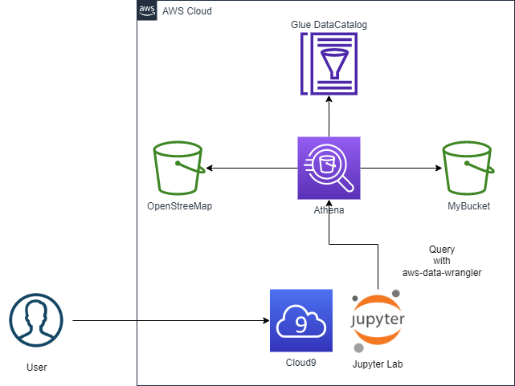

## ハンズオン手順

### Athena 準備

1. S3のコンソールにログインし、Athenaのクエリ保存用のバケットを作成する
   * クエリの出力はこのバケットに保存される
   * バケット名以外はすべてデフォルトでOK
   * バケット名は一意になるように名前をつけてください (ex. athena-query-results-20220708-[適当な文字列]) 
   * 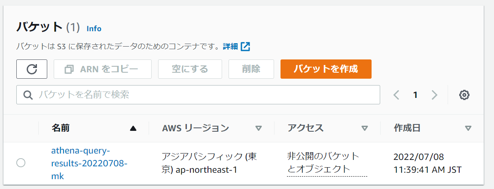{width=200}
2. Athenaのコンソールにログインする
   * [クエリエディタ] -> [設定] -> [管理] -> [クエリ結果の場所]に上記のS3バケットを指定する
     * S3バケットは空ではないとエラーになります
   * 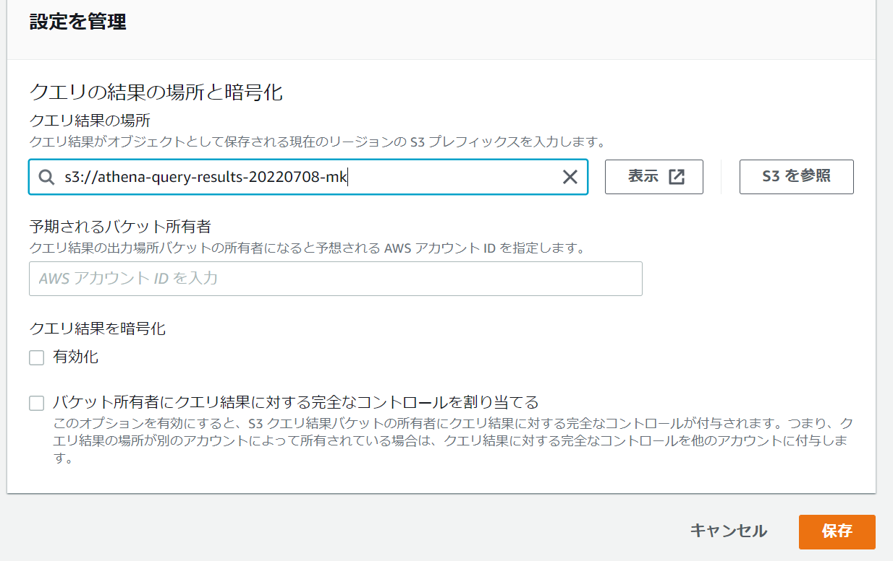

### クエリの実行

1. 下記のURLないのDocumentからOpenStreetMapのS3保存先から外部テーブルを作成方法を確認する
    https://registry.opendata.aws/osm/ 
    ```sql
    CREATE EXTERNAL TABLE planet (
        id BIGINT,
        type STRING,
        tags MAP<STRING,STRING>,
        lat DECIMAL(9,7),
        lon DECIMAL(10,7),
        nds ARRAY<STRUCT<REF:BIGINT>>,
        members ARRAY<STRUCT<TYPE:STRING,REF:BIGINT,ROLE:STRING>>,
        changeset BIGINT,
        timestamp TIMESTAMP,
        uid BIGINT,
        user STRING,
        version BIGINT,
        visible BOOLEAN
    )
    STORED AS ORCFILE
    LOCATION 's3://osm-pds/planet/';
    ```
2. Athenaの[クエリエディタ] -> [エディタ] -> [+] (必要に応じて)から、上記のクエリを実行する。
    * Glue Data Catalogにplanetテーブルが登録される
    * 左のペインのテーブルに`planet`テーブルが表示される
    * 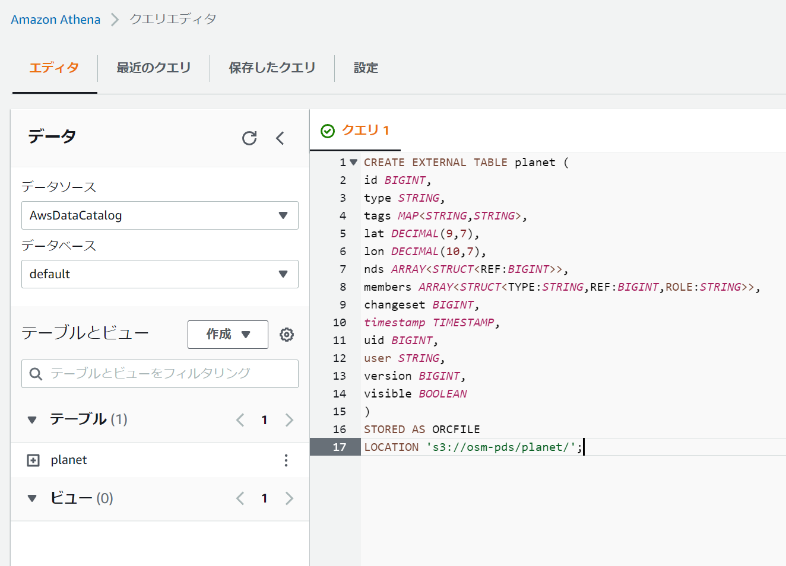
3. CTASを使って、`type=node`なデータで`日本`に存在するデータのみでテーブルを作る
    * `planet`テーブルを全データをスキャンすると90GB程度ある。費用や性能的にこのテーブルを毎回クエリするのは良くない。
    * `type=node`は緯度経度をもつ建物などのデータ。他にも`type=highway`などのデータがある。
      * https://wiki.openstreetmap.org/wiki/Node
    * `日本`のみを表すには、日本を取り囲む緯度経度の多角形内に、`type=node`の緯度経度が存在するかを調べる
      * 下記のGeoFabrikにエリアの多角形情報(.poly)があるのでそれを参照すると良い
        https://download.geofabrik.de/asia/japan.html
    * 多角形内に存在するかどうかを調べるGIS用の関数`ST_Containes()`を使用して下記のようなSQLを発行し、`osm_node_jp`テーブルを作成する
        ```sql
        CREATE TABLE osm_node_jp
        WITH (
            format='ORC',                   -- ORCフォーマット
            write_compression = 'SNAPPY',   -- SNAPPY圧縮 (展開の高速さを重視した圧縮形式)
            bucketed_by = ARRAY['id'],      -- バケッティング対象のカラム
            bucket_count = 9                -- バケッティングの数 (全体で90)
        ) AS
        SELECT
            id,
            type,
            tags,
            lat,
            lon
        FROM
            planet
        WHERE
            type = 'node'
        AND cardinality(tags) != 0
        AND ST_Contains('polygon ((149.1253 22.84562,142.0845 22.06271,141.5486 21.23422,136.1323 20.08228,122.5954 23.51966,122.5607 25.84146,128.8145 34.74835,129.3966 35.09403,135.3079 37.5474,140.6634 45.8154,141.2595 45.76178,143.822 45.35215,145.7831 44.72332,145.7227 44.24914,145.3217 43.8048,145.4013 43.69171,145.5551 43.6321,145.7803 43.52864,145.862 43.38359,146.2115 43.09998,154.4709 23.98253,149.1253 22.84562))', ST_Point(lon, lat));
        ```
    * 実行したら、スキャンしたデータ量や実行時間などを確認しておいてください。(一度だけの実行ですが、コストの高いクエリです)
    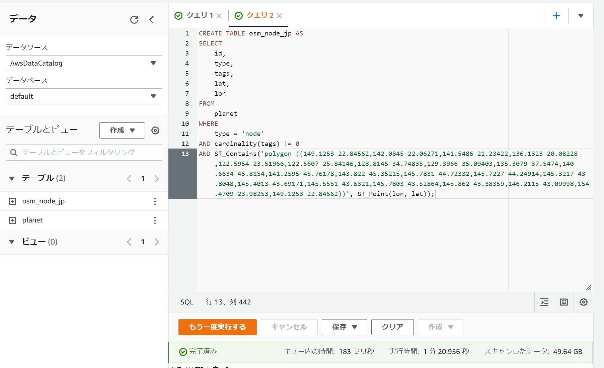
4. 作成した`osm_node_jp`について、いろいろなクエリを実行してみてください (データ総量が90MB程度ですので、何度もクエリして大丈夫です)
   * `tags={}`内に、MAP型で付加情報がついている  
     ex) tags['shop']='convenience' : コンビニ
     どのような情報があるのかはOpenStreetMapに例がある  
     https://wiki.openstreetmap.org/wiki/Map_features
   * 以降のハンズオンでは下記のクエリを実行します
        ```sql
        SELECT
            id,
            lat,
            lon,
            tags['name'] AS name,
            tags['brand'] AS brand
        FROM
            osm_node_jp
        WHERE
            tags['shop'] = 'convenience';
        ```

### 可視化

Cloud9上でJupyterLabを起動して、Notebookで可視化します。
JupyterLabを入れる前に、Cloud9のデフォルトではディスク容量では足りないので、ディスクを拡張します。また利用するleafmapでは可視化にマシンスペックを必要なので、マシンタイプも必要なら変更します。

#### Cloud9のマシンスペックの変更

1. Cloud9を起動します。新規の方は`t3.large`で起動してください。
2. Cloud9が起動したら、EC2のコンソールからCloud9で使用しているVMを停止します。
   Cloud9のWebIDEのタブは閉じておいてください。開いておくとVMを起動する場合があります。
   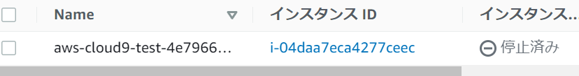
3. (新規に作成した人以外) インスタンスを選択して、右クリックまたはアクションボタンから、`インスタンスタイプの変更`を選択し、`t3.large`に変更してください。
    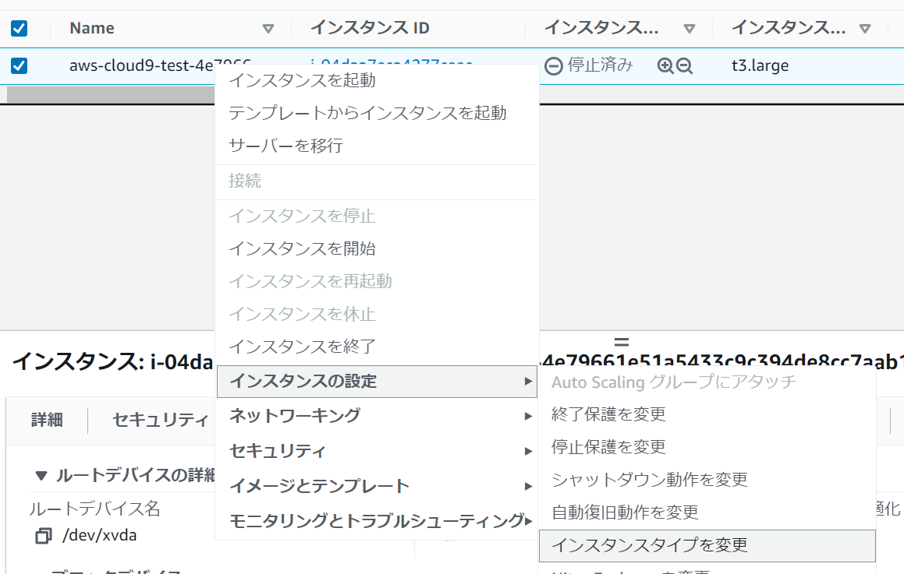
4. (すべての人) VMを選択し、下部のペインからアタッチされているブロックデバイスをクリックします(下図の場合、`vol-0cd0561635a23ea02`)。
   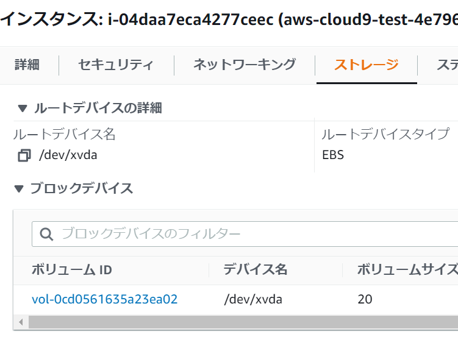
5. 対象のボリュームを選択し、右クリックまたはアクションボタンから、`ボリュームの変更`を選択し、サイズを`20`に変更してください。
   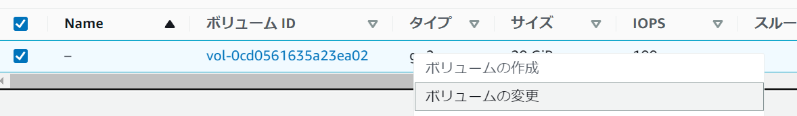
   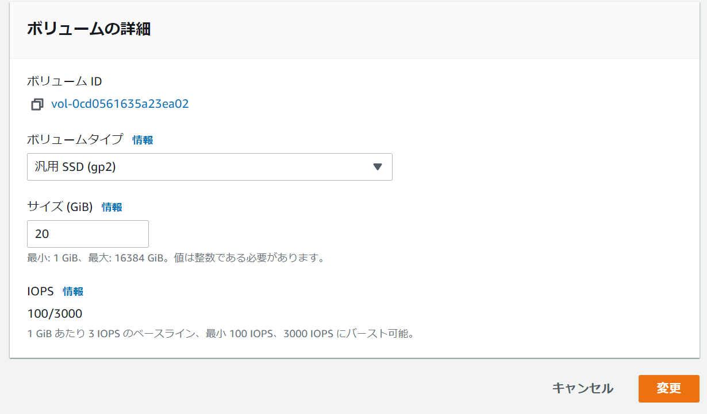

#### Jupyter LabのインストールとGISアプリの実行

1. Cloud9のコンソールから、`OpenIDE`を押してCloud9を起動します
2. `コンソール`タブに下記のコマンドを入力し、Jupyter Lab及び利用するExtensionをインストールします
    ```bash
    sudo yum update -y
    pip3 install jupyterlab
    jupyter labextension install @jupyter-widgets/jupyterlab-manager
    jupyter nbextension install ipyleaflet --user --py
    jupyter nbextension enable ipyleaflet --user --py
    ```
3. このリポジトリにある、`leafmap.ipynb`をCloud9上にコピーします。
    `git clone https://github.com/maskinoshita/athena_gis_example.git`
4. Cloud9上でポート8080,8081,8082で起動したWebアプリ(Http)をPreviewする機能を使って、JupyterLabを表示します。下記のコマンドでJupyterLabを8080ポートで起動します。
    ```bash
    jupyter lab --port 8080 --ip 0.0.0.0
    ```
5. Cloud9の上部にある`Preview`ボタンを押します。Cloud9上のブラウザではエラーになるので、表示されたタブの右端にある`Pop Out Into New Window`ボタンを押します。
   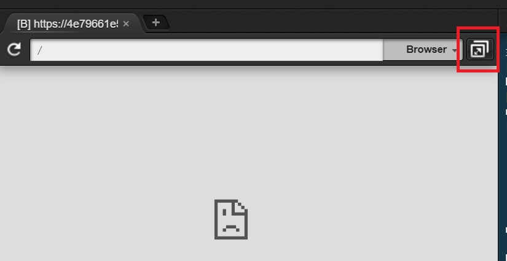
6. JupyterLab上の左のペインから、コピーした`leafmap.ipynb`を開いて実行してください。

#### LeafMapを利用した地図アプリ

詳細は、`leafmap.ipynb`を参照ください。


